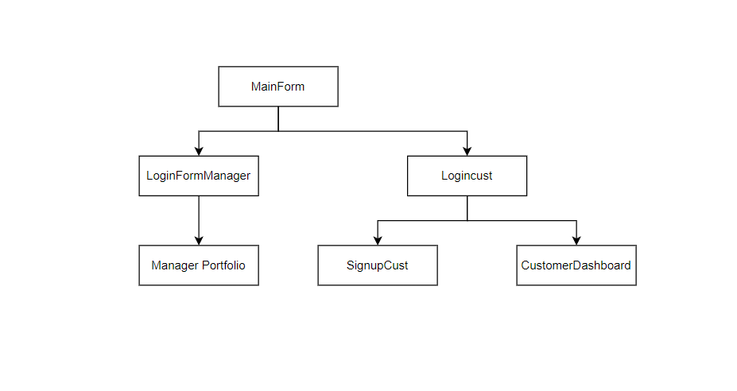

# CS611-Final-Portfolio-Stock-System


## Team Info

Name: Aleksandar Sekulovski  
Email: alesek23@bu.edu  
BU ID: U17467393  

Name: Aru Pandey  
Email: arupande@bu.edu  
BU ID: U14204225

Name: Boyang Liu  
Email: liubyfly@bu.edu  
BU ID: U54290758  

[//]: # (### Todo/Ideas list)

[//]: # (- "readFile" can be a util static function)

[//]: # (- Managers, Tracker, Controller: singleton pattern)

[//]: # (- Controller -> Managers, Tracker: observer pattern)

[//]: # (- Structure the project, build directories like src, database, etc)

[//]: # (- Consider the similarity between managers, can they inherit from Manager)

## Introduction
In this project, we built a stock portfolio management system, 
which contains two major subsystems: a portfolio management system
and a customer stock trading system.

## UML


## Form Structure


## Design Pattern
- Observer Pattern:   
We have a controller as a subject and all interfaces and logical managers 
are observers. Whenever the controller detects some changes or requests,
it will notify related observers to update the interfaces.

- Strategy pattern   
For all observers, they need to implement the NotificationLister interface
to respond to notifications. 

- Singleton Pattern:  
Classes like tradeManager, Notifier can only have one instance, 
so we use a singleton pattern to get the only instance of them.


## Highlights
- Used SQLite to store and fetch data.
- Built clear and easy-to-use interfaces.
- Be able to process different special cases carefully.
- Designed abstract classes like User, which can be easily extended.

## How to run
- Download [sqlite related packages](sqlite-jdbc-3.44.1.0.jar) and prepare environments for SQLite.
- Run Main.java.

## Examples
```

```
